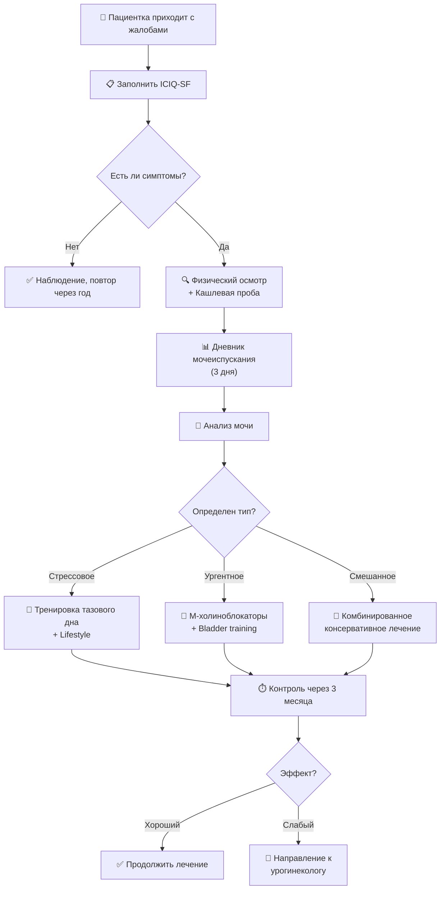

# UroWoman Kazakhstan — Архитектурный документ

## 1. ОПТИМАЛЬНЫЙ ТЕХНИЧЕСКИЙ СТЕК

### Frontend
- **Framework:** Next.js 14+ (App Router)
  - SSR/SSG для SEO медицинского контента
  - API routes для backend-less интеграций
  - Встроенная поддержка мультиязычности (i18n)
  - Отличная производительность на мобильных

- **UI Framework:** TailwindCSS + Shadcn/ui
  - WCAG AAA compliance из коробки
  - Доступность (accessibility) встроена
  - Адаптивный дизайн без custom CSS

- **Интерактивные элементы:**
  - Chart.js / Recharts — графики дневника мочеиспускания
  - React Flow — интерактивные алгоритмы (блок-схемы)
  - Mermaid.js — альтернатива для диаграмм
  - PDF Export: pdfmake + jspdf

- **Состояние и кэширование:**
  - Zustand (управление состоянием опросников)
  - React Query / SWR (кэширование запросов)
  - LocalStorage для сохранения прогресса тестов

### Backend
- **Вариант 1 (быстрый старт):** Next.js API Routes + Prisma ORM
  - /api/questionnaire/iciq-sf (GET/POST)
  - /api/diary/entries (CRUD)
  - /api/export/pdf (генерация отчетов)

- **Вариант 2 (масштабируемость):** Node.js (Express/Fastify) + Prisma
  - Отдельный микросервис для интерактивных расчетов
  - WebSocket для real-time синхронизации
  - Queue система для массовой генерации PDF

### База данных
- **СУБД:** PostgreSQL 15+
  - Ролевая модель (roles) для GDPR
  - Шифрование на уровне БД (pgcrypto)

- **Основные таблицы:**
  ```sql
  -- Пациенты (анонимные)
  users (id, session_id, created_at, last_activity)
  
  -- Опросники
  questionnaires (id, user_id, type, answers, score, created_at)
  
  -- Дневник
  diary_entries (id, user_id, time, volume, urgency, leak, created_date)
  
  -- Результаты тестов
  results (id, user_id, questionnaire_id, pdf_path, exported_at)
  
  -- Аудит для врачей
  doctor_sessions (id, doctor_id, patients_reviewed, action, timestamp)
  ```

### Безопасность и Compliance
- **GDPR/Закон РК о персональных данных:**
  - Anonymous sessions (браузер → случайный session_id, БЕЗ IP-логирования)
  - Данные опросников зашифрованы (AES-256)
  - Автоудаление данных через 90 дней (если не сохранены)
  - Экспорт и удаление данных по требованию пациента

- **API Security:**
  - Rate limiting (50 запросов/час для анонимных)
  - CSRF protection (Double Submit Cookie)
  - Content Security Policy (CSP) headers
  - HTTPS обязателен

### DevOps / Deployment
- **Контейнеризация:** Docker + Docker Compose
- **CI/CD:** GitHub Actions
- **Hosting:** Vercel (Next.js) + Railway (PostgreSQL) или Fly.io
- **CDN:** Cloudflare для статики и кэширования
- **Мониторинг:** Sentry (ошибки), Prometheus (метрики)

---

## 2. АРХИТЕКТУРНАЯ ДИАГРАММА

```
┌─────────────────────────────────────┐
│    Браузер (React компоненты)       │
│  - ICIQ-SF Questionnaire            │
│  - Diary Entry Form                 │
│  - Algorithm Visualizer             │
└──────────────┬──────────────────────┘
               │
       ┌───────▼────────┐
       │  Next.js App   │
       │  (SSR/API)     │
       └───────┬────────┘
               │
       ┌───────▼─────────────┐
       │  Prisma ORM         │
       │  (Data Layer)       │
       └───────┬─────────────┘
               │
       ┌───────▼──────────────────┐
       │  PostgreSQL 15           │
       │  (Encrypted Storage)     │
       └──────────────────────────┘
```

---

## 3. DATA FLOW ДЛЯ ОПРОСНИКА ICIQ-SF

```
Пациент заполняет форму
        ↓
JavaScript валидирует ответы (client-side)
        ↓
Отправка JSON: { frequency: 3, amount: 2, impact: 7 }
        ↓
POST /api/questionnaire/iciq-sf
        ↓
Backend: расчет score = (frequency + amount + impact)
        ↓
Сохранение в БД (encrypted)
        ↓
Генерация PDF отчета
        ↓
Скачивание ИЛИ отправка врачу (с согласием)
```

---

## 4. MERMAID ДИАГРАММА АЛГОРИТМА ДИАГНОСТИКИ



---

## 5. МИГРАЦИЯ ТЕКУЩЕГО ПРОЕКТА

### Фаза 1: Подготовка (1-2 недели)
- Инициализировать Next.js проект
- Настроить TailwindCSS + Shadcn/ui
- Настроить mRTL для поддержки RU/KK/EN
- Настроить PostgreSQL локально

### Фаза 2: Перенос статики (2-3 недели)
- Перенести существующий HTML в React компоненты
- Переписать стили на TailwindCSS
- Перенести logic из script.js в React hooks

### Фаза 3: Интерактивные компоненты (3-4 недели)
- Разработать компонент ICIQ-SF с калькулятором
- Разработать дневник с Chart.js
- Разработать визуализацию алгоритмов

### Фаза 4: Backend + GDPR (4-5 недель)
- Настроить Prisma схему
- Разработать API endpoints
- Добавить шифрование данных
- Реализовать автоудаление старых данных

### Фаза 5: Deployment (1 неделя)
- Docker setup
- GitHub Actions CI/CD
- Развертывание на Vercel/Railway
- Тестирование в production

