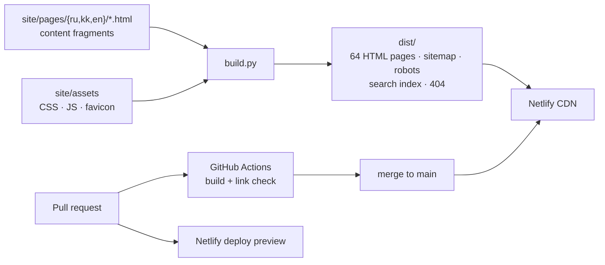
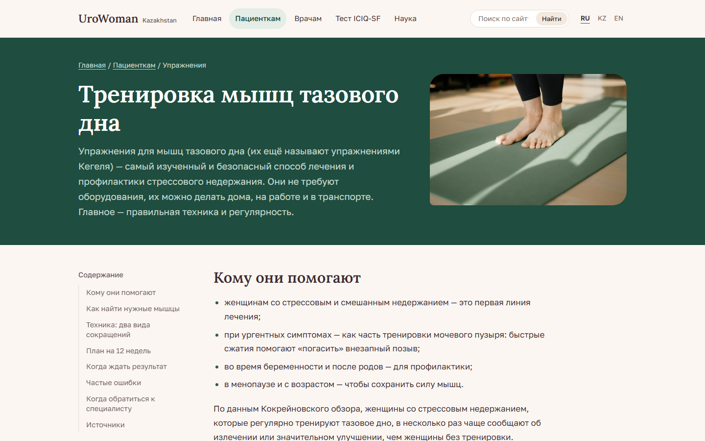
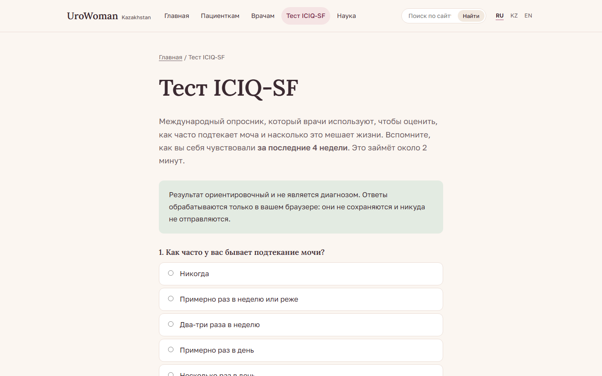

# UroWoman Kazakhstan

**A trilingual health-information website on early detection and prevention of urinary incontinence in women in Kazakhstan.**

[**Live site →**](https://urowoman.netlify.app) · [Русская версия README](README.ru.md)


---

## At a glance

| | |
|---|---|
| **What** | Public education site for patients and primary-care doctors, plus an interactive ICIQ-SF self-assessment |
| **Languages** | Russian, Kazakh, English — every page fully translated |
| **Content** | 21 pages per language, ~30,000 words, every article cites its sources |
| **Stack** | Static site: HTML, CSS, vanilla JS, a ~400-line Python build script (stdlib only) |
| **Hosting** | Netlify CDN, deploy previews for every pull request, GitHub Actions CI |
| **Privacy** | No accounts, no cookies. Test answers stay in the browser unless the visitor opts in to share them anonymously for research |

## The problem

Urinary incontinence affects a large share of adult women, yet many never mention it to a doctor. Reasons include embarrassment, the belief that it is "normal after childbirth" and not knowing that help exists. A 2026 multicentre study of 2,061 women in Kazakhstan ([IJERPH](https://www.mdpi.com/1660-4601/23/7/893)) found that incontinence is linked mainly to obstetric factors and excess weight, both largely preventable. It also found that the condition substantially lowers quality of life.

There was no clear, trustworthy, local-language resource to point women and GPs to. This project fills that gap.

## What I built

### For patients
- **Plain-language articles:** what incontinence is, the types, how assessment works, treatment options, and a 12-week pelvic floor training plan.
- **A prevention section:** risk factors (with data from the Kazakhstan study), pregnancy and postpartum care, myths vs facts, and an FAQ.
- **An ICIQ-SF online test.** It scores 0–21 with Klovning severity bands, records leakage situations to help identify the type, and gives a print/PDF-friendly result to bring to a doctor.

### For doctors
- An overview of international guidelines (NICE NG123, EAU, AUA/SUFU, ICS terminology).
- A step-by-step initial assessment pathway with red-flag referral criteria.
- A management pathway: first-line care, OAB drug treatment principles, follow-up timing and special groups.

### Site features
- Full RU / KZ / EN versions with a language switcher that keeps you on the same page, plus `hreflang` and a multilingual sitemap.
- Client-side full-text search across all articles, with a per-language index generated at build time.
- An automatic table of contents for articles, built from `<h2>` headings.
- Responsive layout (phones, tablets, laptops), keyboard navigation, a skip link, visible focus states, `prefers-reduced-motion` support and print styles.
- Privacy-friendly analytics (GoatCounter: no cookies, no IP storage). It runs on production only, so deploy previews aren't counted.


## Key decisions

**Static site instead of a full-stack app.** An earlier plan proposed Next.js + PostgreSQL + Prisma. I chose pre-rendered static pages because:

- **Load.** A CDN serves static files to thousands of concurrent visitors at no cost. A self-hosted backend on a free tier would become the bottleneck.
- **Privacy and law.** Storing medical answers would put the site under Kazakhstan's personal data law (No. 94-V), including consent, local storage and a responsible operator. Keeping everything in the browser avoids collecting health data at all.
- **Cost and maintenance.** Hosting is free, and there's no server or database to patch.

**Own tiny build step instead of a framework.** Three languages × 21 pages needed a shared layout, SEO tags and a search index, but not a JS framework. A single `build.py` (Python stdlib only) wraps page fragments in the layout, generates `hreflang`, canonical and OG tags, `sitemap.xml`, `robots.txt` and the search index, and can check every internal link and anchor (`--check`).

**Separate pages per language instead of runtime translation.** The original site swapped text with JavaScript, which left pages half-translated and invisible to search engines. Real per-language URLs (`/`, `/kk/`, `/en/`) fix both problems.

**Evidence first.** Every clinical claim is traceable to a source listed at the end of the article: NICE, EAU, AUA/SUFU, Cochrane reviews, the PRIDE trial and the Kazakhstan study. The doctor pages deliberately contain no dosing and defer to national protocols.

## Architecture



## Before and after

| Before | After |
|---|---|
| Language switch produced mixed Russian/Kazakh pages | Complete RU/KZ/EN versions with their own URLs |
| ICIQ-SF showed "minimal" for a score of 0; severity bands were wrong | Correct scoring and Klovning bands, situational question, printable result |
| Stub pages ("section coming soon"), fake "video training" and "clinical cases" cards | Every link leads to real content |
| Demo contact form that sent nothing | Removed; privacy policy reflects what the site actually does |
| Fonts silently failed to load (`@import` at the end of the CSS) | Fixed; Kazakh glyphs verified in both typefaces |
| ~100–150 words per article | ~500–760 words per article, with sources |
| Internal planning docs would have been deployed publicly | Build publishes only `dist/`; outdated docs removed |
| Netlify served a 404 for every URL | Netlify builds with `build.py --check` and publishes `dist/` |



## Workflow

- Every change went through a feature branch and a pull request ([#1](https://github.com/Yerrrzat/UroWoman/pull/1), [#2](https://github.com/Yerrrzat/UroWoman/pull/2), [#3](https://github.com/Yerrrzat/UroWoman/pull/3)) with a description of what changed and why.
- GitHub Actions builds the site and fails on any broken internal link or anchor.
- Netlify publishes a preview URL for each pull request, so changes can be reviewed before merging.

## Run locally

Requires Python 3.8+. No other dependencies.

```bash
python build.py            # build into dist/
python build.py --check    # build and verify all internal links
python build.py --serve    # build and open http://localhost:8080
```

### Deployment settings

Netlify reads `netlify.toml`, runs `python3 build.py --check` and publishes `dist/`. Two environment variables are optional:

- `SITE_URL` sets the public address for canonical links and the sitemap. On Netlify the built-in `URL` is used, so a custom domain is picked up automatically.
- `GOATCOUNTER_CODE` enables analytics on production deploys only.
- `SURVEY_ENDPOINT` turns on the optional research survey on the test page. With consent, a visitor's age, education, employment, marital status and ICIQ-SF answers are appended anonymously to a Google Sheet, which exports to Excel. Setup is described in [`survey/README.md`](survey/README.md).

## Project structure

```
site/
  assets/            styles.css, script.js (search, ICIQ-SF, mobile menu), favicon
  pages/ru|kk|en/    one HTML fragment per page, with a small metadata header
build.py             static site generator, link checker, dev server
survey/              Google Apps Script that stores opt-in survey answers, setup guide
netlify.toml         build command, security and cache headers
.github/workflows/   CI
```

A page looks like this:

```html
<!--
title: Pelvic floor muscle training
description: How to find your pelvic floor muscles and a 12-week plan.
section: patient
layout: article
-->
<h1>…</h1>
```

`layout: article` gives a reading column with an automatic table of contents; `layout: hub` is a section index. Reusable blocks include `note`, `note-warn`, `pair`, `facts`, `flow`, `myth` and `sources`.

## Screenshots

| ICIQ-SF test | Article |
|---|---|
|  |  |

## Disclaimer

The content is educational and does not replace medical advice, diagnosis or treatment. ICIQ-SF is © ICIQ; the on-site version is for self-assessment only.
