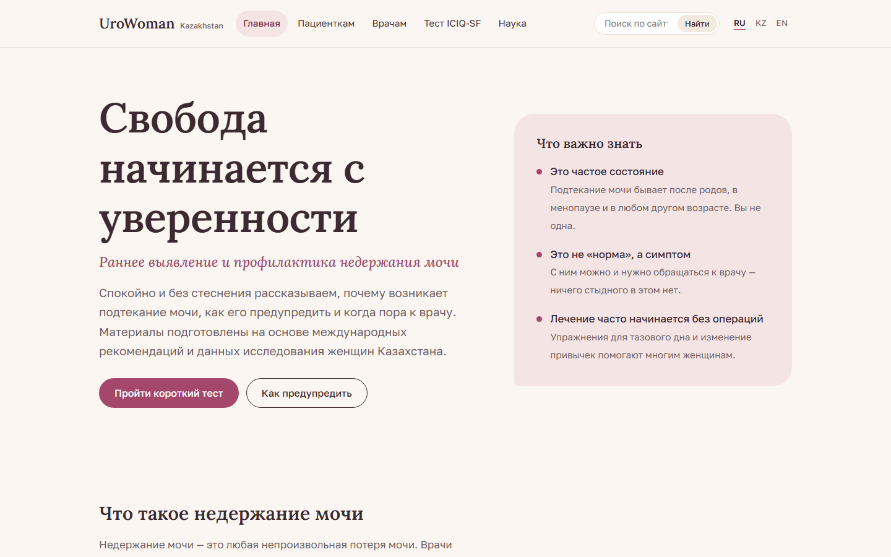
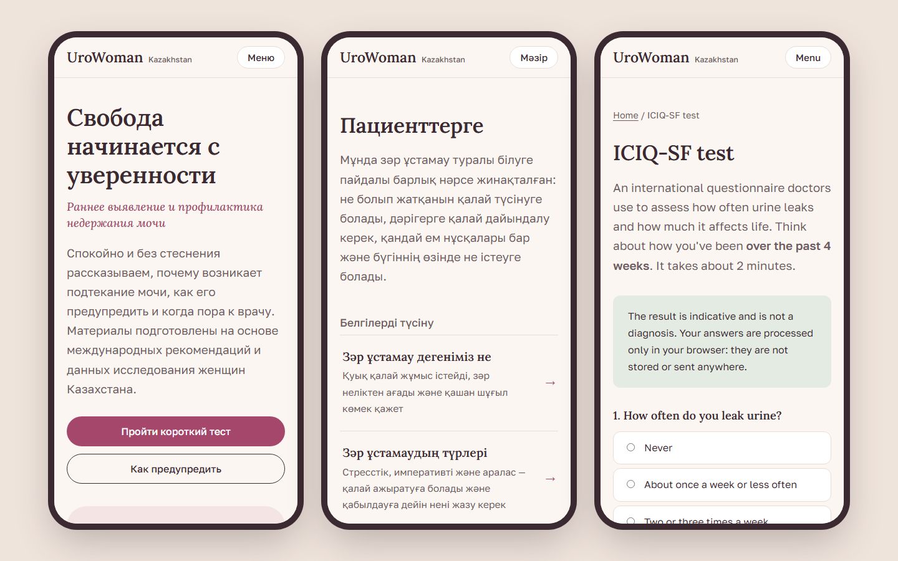

# UroWoman Kazakhstan

**Трёхъязычный информационный сайт о раннем выявлении и профилактике недержания мочи у женщин Казахстана.**

[**Открыть сайт →**](https://urowoman.netlify.app) · [English README](README.md)



## Коротко

| | |
|---|---|
| **Что это** | Образовательный сайт для пациенток и врачей первичного звена с интерактивным тестом ICIQ-SF |
| **Языки** | Русский, казахский, английский — все страницы переведены полностью |
| **Объём** | 21 страница на каждом языке, около 30 000 слов, у каждой статьи список источников |
| **Технологии** | Статический сайт: HTML, CSS, JavaScript без фреймворков, скрипт сборки на Python около 400 строк (только стандартная библиотека) |
| **Хостинг** | Netlify CDN, превью для каждого pull request, проверки в GitHub Actions |
| **Приватность** | Нет регистрации и cookie. Ответы теста остаются в браузере, если посетительница сама не согласится анонимно передать их для исследования |

## Задача

Недержание мочи встречается у значительной части женщин, но многие годами не говорят об этом врачу: стесняются, считают «нормой после родов» или не знают, что есть помощь. В 2026 году вышло многоцентровое исследование 2061 женщины в Казахстане ([IJERPH](https://www.mdpi.com/1660-4601/23/7/893)). Оно показало, что недержание связано прежде всего с акушерскими факторами и избыточным весом, то есть во многом поддаётся профилактике.

При этом понятного, достоверного ресурса на местных языках не было. Этот проект закрывает этот пробел.

## Что сделано

**Для пациенток**
- Статьи простым языком: что это за состояние, какие бывают виды, как проходит обследование, как лечат, план упражнений на 12 недель.
- Раздел профилактики: факторы риска с данными по Казахстану, беременность и роды, мифы и факты, частые вопросы.
- Тест ICIQ-SF: 0–21 балл, градация тяжести по Klovning, вопрос о ситуациях подтекания и результат, который удобно распечатать или сохранить в PDF для врача.

**Для врачей**
- Обзор рекомендаций NICE, EAU, AUA/SUFU и ICS.
- Пошаговый алгоритм первичного обследования с «красными флагами» для направления.
- Алгоритм ведения: первая линия, принципы лечения гиперактивного мочевого пузыря, сроки контроля.

**Возможности сайта**
- Полные версии RU / KZ / EN. Переключатель языка оставляет на той же странице, для поисковиков настроены `hreflang` и многоязычный sitemap.
- Полнотекстовый поиск по статьям в браузере.
- Автоматическое оглавление статей.
- Адаптивная вёрстка, навигация с клавиатуры, стили для печати.
- Статистика GoatCounter без cookie, считается только на боевом сайте.



## Ключевые решения

- **Статический сайт вместо full-stack.** CDN бесплатно выдерживает тысячи одновременных посетителей, а сервер на бесплатном тарифе стал бы узким местом. К тому же сайт не хранит медицинские данные, поэтому на него не распространяются требования закона РК № 94-V о персональных данных.
- **Свой маленький сборщик вместо фреймворка.** `build.py` собирает страницы в общий шаблон, генерирует SEO-теги, sitemap и поисковый индекс, а также проверяет все внутренние ссылки.
- **Отдельные страницы для каждого языка** вместо подмены текста через JavaScript: так страницы переведены полностью и индексируются поисковиками.
- **Опора на источники.** Каждое медицинское утверждение подкреплено ссылкой. В разделе для врачей нет дозировок, вместо них отсылка к протоколам МЗ РК.

## Процесс работы

Все изменения шли через отдельные ветки и pull request ([#1](https://github.com/Yerrrzat/UroWoman/pull/1), [#2](https://github.com/Yerrrzat/UroWoman/pull/2), [#3](https://github.com/Yerrrzat/UroWoman/pull/3)). GitHub Actions собирает сайт и проверяет ссылки, Netlify публикует превью каждого PR.

## Запуск

Нужен только Python 3.8+.

```bash
python build.py --serve
```

Подробнее о структуре страниц и готовых блоках — в [английской версии README](README.md#project-structure).

## Дисклеймер

Материалы носят информационный характер и не заменяют консультацию врача. ICIQ-SF © ICIQ.
